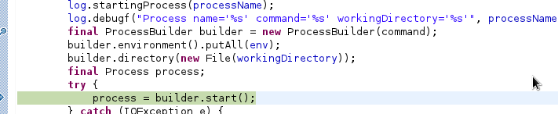

# 概述

JBoss 7/WildFly 以 domain 模式启动时会启动多个 JVM，本文主要研究 domain 模式下是如何启动多个 JVM 的。

# 从启动脚本开始

domain.sh 脚本中如下信息:

~~~
      eval \"$JAVA\" -D\"[Process Controller]\" $PROCESS_CONTROLLER_JAVA_OPTS \
         \"-Dorg.jboss.boot.log.file=$JBOSS_LOG_DIR/process-controller.log\" \
         \"-Dlogging.configuration=file:$JBOSS_CONFIG_DIR/logging.properties\" \
         -jar \"$JBOSS_HOME/jboss-modules.jar\" \
         -mp \"${JBOSS_MODULEPATH}\" \
         org.jboss.as.process-controller \
         -jboss-home \"$JBOSS_HOME\" \
         -jvm \"$JAVA_FROM_JVM\" \
         -mp \"${JBOSS_MODULEPATH}\" \
         -- \
         \"-Dorg.jboss.boot.log.file=$JBOSS_LOG_DIR/host-controller.log\" \
         \"-Dlogging.configuration=file:$JBOSS_CONFIG_DIR/logging.properties\" \
         $HOST_CONTROLLER_JAVA_OPTS \
         -- \
         -default-jvm \"$JAVA_FROM_JVM\" \
         '"$@"'
      JBOSS_STATUS=$?
~~~

基于 JBoss Module 类加载机制，我们查看 org.jboss.as.process-controller，在 `module.xml` 的描述中启动 Main 方法如下:

~~~
<module xmlns="urn:jboss:module:1.1" name="org.jboss.as.process-controller">
    <properties>
        <property name="jboss.api" value="private"/>
    </properties>

    <main-class name="org.jboss.as.process.Main"/>
~~~

所以我们可以从 `org.jboss.as.process.Main` 类开始，JBoss 是完全开源的，这样很容易开始调试代码，通过如下步骤可以开始调试启动代码：

* 在 pom.xml 中添加如下依赖

~~~
		<dependency>
			<groupId>org.jboss.as</groupId>
			<artifactId>jboss-as-process-controller</artifactId>
			<version>7.2.0.Final-redhat-8</version>
		</dependency>
~~~

* 编辑 domain.conf，添加如下配置

~~~
PROCESS_CONTROLLER_JAVA_OPTS="$PROCESS_CONTROLLER_JAVA_OPTS -agentlib:jdwp=transport=dt_socket,address=8788,server=y,suspend=y"
HOST_CONTROLLER_JAVA_OPTS="$HOST_CONTROLLER_JAVA_OPTS -agentlib:jdwp=transport=dt_socket,address=8787,server=y,suspend=y"
~~~

* 以 domain 模式启动 JBoss，在 `org.jboss.as.process.Main` 的 main 方法中添加断点，开始代码调试，如下图所示：

对照之前的启动脚本，main 方法传入的参数如下：

~~~
-jboss-home, /home/kylin/work/eap/jboss-eap-6.1, 
-jvm, /usr/java/jdk1.7.0_21/bin/java, 
-mp, /home/kylin/work/eap/jboss-eap-6.1/modules, 
--, 
-Dorg.jboss.boot.log.file=/home/kylin/work/eap/jboss-eap-6.1/domain/log/host-controller.log, 
-Dlogging.configuration=file:/home/kylin/work/eap/jboss-eap-6.1/domain/configuration/logging.properties, 
-server, -Xms63m, -Xmx512m, -XX:MaxPermSize=256m, -Djava.net.preferIPv4Stack=true, -Djboss.modules.system.pkgs=org.jboss.byteman, 
-Djava.awt.headless=true, -agentlib:jdwp=transport=dt_socket,address=8787,server=y,suspend=y, 
--, 
-default-jvm, /usr/java/jdk1.7.0_21/bin/java
~~~

# domain 模式启动

下图描述 domain 模式启动的过程：

# Process Controller 如何启动 Host Controller

Process Controller 和 Host Controller 属于不同的 JVM，Process Controller 启动 Host Controller 是在一个 JVM 中启动另一个 JVM，启动代码位于 `org.jboss.as.process.ManagedProcess` 如下图所示：

我们可以通过如下代码模拟：

~~~
	public static void main(String[] args) throws IOException {
		
		 List<String> command = new ArrayList<String>();
		 command.add("/usr/java/jdk1.7.0_21/bin/java");
		 command.add("-jar");
		 command.add("/home/kylin/work/eap/jboss-eap-6.1/jboss-modules.jar");
		 command.add("-version");
		 ProcessBuilder builder = new ProcessBuilder(command);
		 builder.directory(new File("/home/kylin/tmp"));
		 Process process = builder.start();
		 final InputStream stdout = process.getInputStream();
		 Thread stdoutThread = new Thread(new ReadTask(stdout, System.out));
		 stdoutThread.start();
	}
~~~

[点击查看完整代码](src/main/java/org/wildfly/domain/test/PCStartHC.java)

运行如上代码输出JBoss EAP 6.1 所使用的 JBoss Module 的版本号：

~~~
[Host Controller] JBoss Modules version 1.2.0.Final-redhat-1
~~~

而上面调试过程中 ProcessBuilder 传入的参数如下：

~~~
/usr/java/jdk1.7.0_21/bin/java, -D[Host Controller], 
-Dorg.jboss.boot.log.file=/home/kylin/work/eap/jboss-eap-6.1/domain/log/host-controller.log, 
-Dlogging.configuration=file:/home/kylin/work/eap/jboss-eap-6.1/domain/configuration/logging.properties, 
-server, -Xms63m, -Xmx512m, -XX:MaxPermSize=256m, -Djava.net.preferIPv4Stack=true, -Djboss.modules.system.pkgs=org.jboss.byteman, 
-Djava.awt.headless=true, -agentlib:jdwp=transport=dt_socket,address=8787,server=y,suspend=y, 
-jar, /home/kylin/work/eap/jboss-eap-6.1/jboss-modules.jar, 
-mp, /home/kylin/work/eap/jboss-eap-6.1/modules, 
-jaxpmodule, javax.xml.jaxp-provider, org.jboss.as.host-controller,
 
-mp, /home/kylin/work/eap/jboss-eap-6.1/modules, 
--pc-address, 127.0.0.1, 
--pc-port, 50396, 
-default-jvm, /usr/java/jdk1.7.0_21/bin/java, 
-Djboss.home.dir=/home/kylin/work/eap/jboss-eap-6.1
~~~

如上参数被分为两个部分，上面部分用来启动 Host Controller，下面部分作为 Main 方法参数，传递给 org.jboss.as.host-controller 模块定义的 main-class 中，查看 main-class 定义如下:

~~~
<module xmlns="urn:jboss:module:1.1" name="org.jboss.as.host-controller">
    <properties>
        <property name="jboss.api" value="private"/>
    </properties>

    <main-class name="org.jboss.as.host.controller.Main"/>

    <resources>
        <resource-root path="jboss-as-host-controller-7.2.0.Final-redhat-8.jar"/>
~~~

如上，我们可以在 `org.jboss.as.host.controller.Main` 中设定断点，继续调试 Host Controller 启动。
