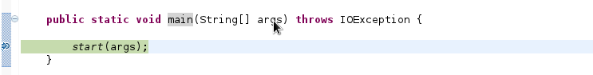
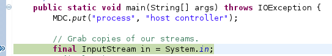

# 概述

JBoss 7/WildFly 以 domain 模式启动时会启动多个 JVM，例如如下通过启动脚本启动 domain 模式：

~~~
./domain.sh
~~~

启动后我们查看进程：

~~~
[kylin@localhost tdump]$ jps -l
23655 /home/kylin/work/eap/jboss-eap-6.1/jboss-modules.jar
23671 /home/kylin/work/eap/jboss-eap-6.1/jboss-modules.jar
23736 /home/kylin/work/eap/jboss-eap-6.1/jboss-modules.jar
~~~

我们可以发现 domain 模式启动时会启动后，有三个进程（对应三个JVM）运行。本文主要研究 domain 模式下是如何启动多个 JVM 的。

> `jboss-modules.jar` 是 JBoss 底层类加载机制，用于启动一个 JVM

# 从启动脚本开始

domain.sh 脚本中如下信息:

~~~
      eval \"$JAVA\" -D\"[Process Controller]\" $PROCESS_CONTROLLER_JAVA_OPTS \
         \"-Dorg.jboss.boot.log.file=$JBOSS_LOG_DIR/process-controller.log\" \
         \"-Dlogging.configuration=file:$JBOSS_CONFIG_DIR/logging.properties\" \
         -jar \"$JBOSS_HOME/jboss-modules.jar\" \
         -mp \"${JBOSS_MODULEPATH}\" \
         org.jboss.as.process-controller \
         -jboss-home \"$JBOSS_HOME\" \
         -jvm \"$JAVA_FROM_JVM\" \
         -mp \"${JBOSS_MODULEPATH}\" \
         -- \
         \"-Dorg.jboss.boot.log.file=$JBOSS_LOG_DIR/host-controller.log\" \
         \"-Dlogging.configuration=file:$JBOSS_CONFIG_DIR/logging.properties\" \
         $HOST_CONTROLLER_JAVA_OPTS \
         -- \
         -default-jvm \"$JAVA_FROM_JVM\" \
         '"$@"'
      JBOSS_STATUS=$?
~~~

基于 JBoss Module 类加载机制，我们查看 org.jboss.as.process-controller，在 `module.xml` 的描述中启动 Main 方法如下:

~~~
<module xmlns="urn:jboss:module:1.1" name="org.jboss.as.process-controller">
    <properties>
        <property name="jboss.api" value="private"/>
    </properties>

    <main-class name="org.jboss.as.process.Main"/>
~~~

所以我们可以从 `org.jboss.as.process.Main` 类开始，JBoss 是完全开源的，这样很容易开始调试代码，通过如下步骤可以开始调试启动代码：

* 在 pom.xml 中添加如下依赖

~~~
		<dependency>
			<groupId>org.jboss.as</groupId>
			<artifactId>jboss-as-process-controller</artifactId>
			<version>7.2.0.Final-redhat-8</version>
		</dependency>
~~~

* 编辑 domain.conf，添加如下配置

~~~
PROCESS_CONTROLLER_JAVA_OPTS="$PROCESS_CONTROLLER_JAVA_OPTS -agentlib:jdwp=transport=dt_socket,address=8788,server=y,suspend=y"
HOST_CONTROLLER_JAVA_OPTS="$HOST_CONTROLLER_JAVA_OPTS -agentlib:jdwp=transport=dt_socket,address=8787,server=y,suspend=y"
~~~

* 以 domain 模式启动 JBoss，在 `org.jboss.as.process.Main` 的 main 方法中添加断点，开始代码调试，如下图所示：

对照之前的启动脚本，main 方法传入的参数如下：

~~~
-jboss-home, /home/kylin/work/eap/jboss-eap-6.1, 
-jvm, /usr/java/jdk1.7.0_21/bin/java, 
-mp, /home/kylin/work/eap/jboss-eap-6.1/modules, 
--, 
-Dorg.jboss.boot.log.file=/home/kylin/work/eap/jboss-eap-6.1/domain/log/host-controller.log, 
-Dlogging.configuration=file:/home/kylin/work/eap/jboss-eap-6.1/domain/configuration/logging.properties, 
-server, -Xms63m, -Xmx512m, -XX:MaxPermSize=256m, -Djava.net.preferIPv4Stack=true, -Djboss.modules.system.pkgs=org.jboss.byteman, 
-Djava.awt.headless=true, -agentlib:jdwp=transport=dt_socket,address=8787,server=y,suspend=y, 
--, 
-default-jvm, /usr/java/jdk1.7.0_21/bin/java
~~~

# domain 模式启动

下图描述 domain 模式启动的过程：

根据上图描述，我们将 domain 模式启动描述为以下步骤:

* 通过启动脚本 `domain.sh` 启动 *Process Controller* JVM，*Process Controller* 启动后监听于端口 0，该段口等待 Host Controller JVM 连接

* Process Controller 启动 Host Controller，我们随后详细介绍 Process Controller 如何启动 Host Controller, Host Controller 启动后，首先解析 `host.xml` 文件，获取要启动 Server 信息，并与 Process Controller 建立 TCP 连接，将启动 Server 的信息发送给 Process Controller

* Process Controller 根据 Host Controller 发送的 Server 信息，启动相关的 Server

> 如上图，我们可以看到三个 JVM 启动的 Main 方法分别位于三个不同的 module 中： `org.jboss.as.process-controller` (对应的 Main 方法为 `org.jboss.as.process.Main`), `org.jboss.as.host-controller ` (对应的 Main 方法为 `org.jboss.as.host.controller.Main`), `org.jboss.as.server` (对应的 Main 方法为 `org.jboss.as.server.DomainServerMain`)。

# Process Controller 如何启动 Host Controller

Process Controller 和 Host Controller 属于不同的 JVM，Process Controller 启动 Host Controller 是在一个 JVM 中启动另一个 JVM，启动代码位于 `org.jboss.as.process.ManagedProcess` 如下图所示：

我们可以通过如下代码模拟：

~~~
	public static void main(String[] args) throws IOException {
		
		 List<String> command = new ArrayList<String>();
		 command.add("/usr/java/jdk1.7.0_21/bin/java");
		 command.add("-jar");
		 command.add("/home/kylin/work/eap/jboss-eap-6.1/jboss-modules.jar");
		 command.add("-version");
		 ProcessBuilder builder = new ProcessBuilder(command);
		 builder.directory(new File("/home/kylin/tmp"));
		 Process process = builder.start();
		 final InputStream stdout = process.getInputStream();
		 Thread stdoutThread = new Thread(new ReadTask(stdout, System.out));
		 stdoutThread.start();
	}
~~~

[点击查看完整代码](domain-deployment/src/main/java/org/wildfly/domain/test/PCStartHC.java)

运行如上代码输出JBoss EAP 6.1 所使用的 JBoss Module 的版本号：

~~~
[Host Controller] JBoss Modules version 1.2.0.Final-redhat-1
~~~

而上面调试过程中 ProcessBuilder 传入的参数如下：

~~~
/usr/java/jdk1.7.0_21/bin/java, -D[Host Controller], 
-Dorg.jboss.boot.log.file=/home/kylin/work/eap/jboss-eap-6.1/domain/log/host-controller.log, 
-Dlogging.configuration=file:/home/kylin/work/eap/jboss-eap-6.1/domain/configuration/logging.properties, 
-server, -Xms63m, -Xmx512m, -XX:MaxPermSize=256m, -Djava.net.preferIPv4Stack=true, -Djboss.modules.system.pkgs=org.jboss.byteman, 
-Djava.awt.headless=true, -agentlib:jdwp=transport=dt_socket,address=8787,server=y,suspend=y, 
-jar, /home/kylin/work/eap/jboss-eap-6.1/jboss-modules.jar, 
-mp, /home/kylin/work/eap/jboss-eap-6.1/modules, 
-jaxpmodule, javax.xml.jaxp-provider, org.jboss.as.host-controller,
 
-mp, /home/kylin/work/eap/jboss-eap-6.1/modules, 
--pc-address, 127.0.0.1, 
--pc-port, 50396, 
-default-jvm, /usr/java/jdk1.7.0_21/bin/java, 
-Djboss.home.dir=/home/kylin/work/eap/jboss-eap-6.1
~~~

如上参数被分为两个部分，上面部分用来启动 Host Controller，下面部分作为 Main 方法参数，传递给 org.jboss.as.host-controller 模块定义的 main-class 中，查看 main-class 定义如下:

~~~
<module xmlns="urn:jboss:module:1.1" name="org.jboss.as.host-controller">
    <properties>
        <property name="jboss.api" value="private"/>
    </properties>

    <main-class name="org.jboss.as.host.controller.Main"/>

    <resources>
        <resource-root path="jboss-as-host-controller-7.2.0.Final-redhat-8.jar"/>
~~~

如上，我们可以在 `org.jboss.as.host.controller.Main` 中设定断点，继续调试 Host Controller 启动，如下

`org.jboss.as.host.controller.Main` 中传入的参数如下：

~~~
-mp, /home/kylin/work/eap/jboss-eap-6.1/modules, 
--pc-address, 127.0.0.1, 
--pc-port, 45210, 
-default-jvm, /usr/java/jdk1.7.0_21/bin/java, 
-Djboss.home.dir=/home/kylin/work/eap/jboss-eap-6.1
~~~

> 注意，如前面分析，这些参数是从 Process Controller 传递过来的，且通过代码调试显示这些参数与之前分析的相同。

# Process Controller 启动 Server

Process Controller 启动 Server 过程完全类似，只是要启动的 Server 信息是通过 Host Controller传递过来的，传递过来的 ProcessBuilder 传入的参数如下：

~~~
/usr/java/jdk1.7.0_21/bin/java, -D[Server:server-one], 
-XX:PermSize=256m, -XX:MaxPermSize=256m, -Xms1303m, -Xmx1303m, -server, -D[Host Controller]=true, 
-Djava.awt.headless=true, -Djboss.modules.system.pkgs=org.jboss.byteman, -Djboss.home.dir=/home/kylin/work/eap/jboss-eap-6.1, 
-Djava.net.preferIPv4Stack=true, -Djboss.server.log.dir=/home/kylin/work/eap/jboss-eap-6.1/domain/servers/server-one/log, 
-Djboss.server.temp.dir=/home/kylin/work/eap/jboss-eap-6.1/domain/servers/server-one/tmp, 
-Djboss.server.data.dir=/home/kylin/work/eap/jboss-eap-6.1/domain/servers/server-one/data, 
-Dlogging.configuration=file:/home/kylin/work/eap/jboss-eap-6.1/domain/servers/server-one/data/logging.properties, 
-jar, /home/kylin/work/eap/jboss-eap-6.1/jboss-modules.jar, 
-mp, /home/kylin/work/eap/jboss-eap-6.1/modules, -jaxpmodule, javax.xml.jaxp-provider, org.jboss.as.server
~~~

通过 `org.jboss.as.server` 我们可以找到 Server JVM 启动的 Main 方法为 `org.jboss.as.server.DomainServerMain`

# 如何理解 PC，HC，Server

PC 是指 Process Controller，HC 是指 Host Controller（与 HC 相对应的是 Domain Controller，简称 DC），Server 指的是 JBoss 服务器。

从功能层面来说，PC 用来启动和停止 HC 和 Server，且PC 启动停止 Server 首先需要得到 HC 发来的指令，domain 模式启动完成后会启动如下线程用来停止 HC 和 Servers

~~~
"reaper for Host Controller" prio=10 tid=0x7fc3b000 nid=0x770f in Object.wait() [0x803ab000]
"reaper for Server:server-one" prio=10 tid=0x8320b400 nid=0x7750 in Object.wait() [0x7fdfe000]
~~~

PC 启动 HC 与 Server 是在一个 JVM 中启动另一个 JVM，这样 HC 与 Server 中 System.out 和 System.err 流需要使用 PC 中的相应流，所以 PC 的另一个左右是输出 PC 和 Server 中输出流打印输出的信息，domain 模式启动完成后会启动如下线程用来完成此任务

~~~
"stdout for Host Controller" prio=10 tid=0x7fc3a400 nid=0x770e runnable [0x803fc000]
"stderr for Host Controller" prio=10 tid=0x7fc36000 nid=0x770d runnable [0x8087d000]
"stdout for Server:server-one" prio=10 tid=0x83209c00 nid=0x774f runnable [0x7ff5c000]
"stderr for Server:server-one" prio=10 tid=0x83208400 nid=0x774e runnable [0x7ffad000]
~~~

HC 用来管理 Server，Domain 模式的设计的一个目的就是在一台物理服务器上通过端口偏移运行多个 Server，HC 设计用来管理这些 Server，Domain 模式的设计的另一个目的是多个物理机器上的多个 Server 可以被统一管理，HC 也可以管理多个物理机器上的多个机器，这种情况下我们称 HC 为 DC，关于如何配置 DC 不属于此处讨论的范畴。

Server 是指 JBoss 服务器平台，为 JEE 应用提供容器。

# 关闭 Server

本部分演示通过 OS 信号关闭 Server 时 PC 和 HC 相关的 Action。我们通过如下步骤演示：

* 以 domain 模式启动JBoss

* 使用 `kill -9 PID` 关闭 Server

观察日志，我们看到如下日志输出:

~~~
21:39:08,800 INFO  [org.jboss.as.process.Server:server-one.status] (reaper for Server:server-one) JBAS012010: Process 'Server:server-one' finished with an exit status of 137
[Host Controller] 21:39:08,801 INFO  [org.jboss.as.host.controller] (ProcessControllerConnection-thread - 2) JBAS010926: Unregistering server server-one
[Host Controller] 21:39:08,806 INFO  [org.jboss.as.host.controller] (Remoting "localhost.localdomain:MANAGEMENT" read-1) JBAS010926: Unregistering server server-one
~~~ 

PC 收到关闭 Server 的信息，HC Unregistering Server，如下为 `reaper for Server:server-one` 线程的代码：

~~~
        public void run() {
            final Process process;
            synchronized (lock) {
                process = ManagedProcess.this.process;
            }
            int exitCode;
            for (;;) try {
                exitCode = process.waitFor();
                log.processFinished(processName, Integer.valueOf(exitCode));
                break;
            } catch (InterruptedException e) {
                // ignore
            }
            boolean respawn = false;
            boolean slowRespawn = false;
            boolean unlimitedRespawn = false;
            int respawnCount = 0;
            synchronized (lock) {

                final long endTime = System.currentTimeMillis();
                processController.processStopped(processName, endTime - startTime);
~~~

分析代码， `reaper for Server:server-one` 线程阻塞于 exitCode = process.waitFor() 行代码，等待关闭信号，且接收到关闭信号后首先日志输出。processController.processStopped(processName, endTime - startTime) 行通知 HC Unregistering Server。
