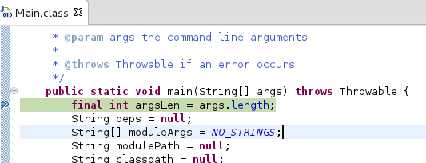

# 调试 jboss modules

当我们完成 JBoss 安装，我们会发现在 JBOSS_HOME 目录下有一个 `jboss-modules.jar`，该 jar 主要加载 JBoss 启动相关的 jar 包，以及启动 JBoss，我们到 JBOSS_HOME 下运行：

~~~
java -jar jboss-modules.jar -version
~~~

会输出相应结果，比如我们使用 JBoss 版本为 EAP 6.1，它对应输出的版本号为

~~~
JBoss Modules version 1.2.0.Final-redhat-1
~~~

通过如下步骤开始调试 jboss modules

* 编辑 standalone.conf，添加如下 JVM 调试参数

~~~
JAVA_OPTS="$JAVA_OPTS -agentlib:jdwp=transport=dt_socket,address=8787,server=y,suspend=y"
~~~

* 添加 `jboss-modules.jar` 到当前 classpath

* 在 org.jboss.modules.Main 类 main() 方法中添加断点后，启动 JBoss，开始调试，如下图
 

main() 方法中传入参数如下：

~~~
-mp, /home/kylin/work/eap/jboss-eap-6.1/modules, 
-jaxpmodule, javax.xml.jaxp-provider, 
org.jboss.as.standalone, 
-Djboss.home.dir=/home/kylin/work/eap/jboss-eap-6.1, 
-Djboss.server.base.dir=/home/kylin/work/eap/jboss-eap-6.1/standalone
~~~

对应 JBoss 启动脚本，standalone.sh 脚本中如下信息:

~~~
   if [ "x$LAUNCH_JBOSS_IN_BACKGROUND" = "x" ]; then
      # Execute the JVM in the foreground
      eval \"$JAVA\" -D\"[Standalone]\" $JAVA_OPTS \
         \"-Dorg.jboss.boot.log.file=$JBOSS_LOG_DIR/server.log\" \
         \"-Dlogging.configuration=file:$JBOSS_CONFIG_DIR/logging.properties\" \
         -jar \"$JBOSS_HOME/jboss-modules.jar\" \
         -mp \"${JBOSS_MODULEPATH}\" \
         -jaxpmodule "javax.xml.jaxp-provider" \
         org.jboss.as.standalone \
         -Djboss.home.dir=\"$JBOSS_HOME\" \
         -Djboss.server.base.dir=\"$JBOSS_BASE_DIR\" \
         "$SERVER_OPTS"
      JBOSS_STATUS=$?
~~~

我们很容易发现，这些参数是从启动脚本中传入。

# 调试 standalone 启动

同样从上面给出的启动脚本，我们可以看到启动的可执行 module 为 `org.jboss.as.standalone`，我们查看该 module 对应的描述文件 `modules/system/layers/base/org/jboss/as/standalone/main/module.xml` 中 Main 方法如下:

~~~
<module xmlns="urn:jboss:module:1.1" name="org.jboss.as.standalone">
    <main-class name="org.jboss.as.server.Main"/>
~~~

在 `org.jboss.as.server.Main` 中添加调试断点开始调试如下：

对照启动脚本，Main 方法中传入了两个参数：

~~~
-Djboss.home.dir=/home/kylin/work/eap/jboss-eap-6.1, 
-Djboss.server.base.dir=/home/kylin/work/eap/jboss-eap-6.1/standalone
~~~
