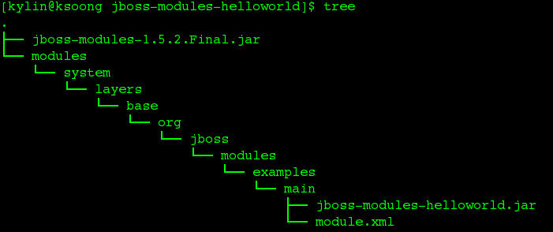

= 概述
:toc: manual
:toc-placement: preamble

从 JBoss AS7 开始，Classloader 这块开始使用全新的 JBoss Modules。本文简单介绍说明JBoss Modules的设计思路，以及给出一个例子说明这一设计思路。

== JBoss Modules 介绍

Java 一直使用 扁平 classpat h的方式来加载所有 class 和 jar 等资源。这样的方式会造成许多问题，比如下面这些经常会遇到的问题： 

* 一个大的项目中，有的 classpath 当中的资源被加载后可能根本不会被用到，这就造成了系统资源的浪费
* 同一个 classpath 当中的资源，可能包含多个不同版本的同一个资源，这就造成了版本冲突，可能会导致整个项目无法运行并且很难进行排错，因为我们的项目可能非常大，里面有成百上千个jar，要想找到相冲突的资源，非常困难

针对这些问题，JBoss Modules 从设计上面给出了解决方案：

* 通过使用 module.xml 描述文件定义模块，在这个描述文件中要包含模块的名称，都包含哪些资源（一般一个模块对应一个jar文件，也可以包含多个jar或其它资源），这些资源的版本号，以及这个模块都依赖于哪些模块。
* 每一个模块都可以实时地加载或卸掉。这样做有很多好处：首先是资源方面的节省，只有需要的模块才被加载（这一点是通过module.xml中定义的模块之间的依赖关系来实现的），这一方式同时来带的好处是：整个系统的加载速度大大提升了

== JBoss Modules 定义 

JBoss Modules 是一个适用于Java的模块化(非分层)类加载以及执行环境的实现。换句话说，不同于Java传统的使用单个类加载器载入classpath中的所有JAR文件，每一个库(library,可以理解为完成某一个功能的一系列jar的组合)成为一个module，该module仅链接其依赖的其他module，而不再依赖其它任何资源。JBoss Module实现了一个线程安全的，快速的，高并发的类加载器委派(delegating)模型，再加上一个可扩展的模块解析引擎，形成一个独特的，简单的，强大的应用程序执行和分布系统。

JBoss Modules被设计为能够和现有的library或者application一起工作而不需要任何的修改，这是因为它简单命名和解析策略。不像OSGi，JBoss Modules并没有实现一个容器；而是一个瘦的启动包装器，在一个模块化环境执行一个应用。这时，你的应用接管控制权，模块化则准备好在需要时装载和连接各模块。此外，只有当一个模块被依赖的时候，它才会被装载(并不会为了解析目的而装载)，这意味着，模块化应用程序的性能仅依赖于实际使用的模块数(并在模块被使用的时候)，而不是系统中的模块总数目。并且，模块可以在任何时候由用户卸载。

== JBoss Modules 使用

一个模块化程序使用以下命令启动:

[source,java]
----
java -jar jboss-modules.jar -mp path/to/modules my.main.module.name
----

在模块路径(-mp)中需要指定默认模块加载器需要搜素加载模块的根目录。my.main.module.name 指定要运行的模块名称。

[source,xml]
.*一个模块使用简单的XML描述符进行定义示例*
----
<module xmlns="urn:jboss:module:1.3" name="org.jboss.msc">

    <properties>
        <property name="jboss.require-java-version" value="1.8"/>
    </properties>

    <main-class name="org.jboss.msc.Version"/>

    <resources>
        <resource-root path="jboss-msc-1.2.6.Final.jar"/>
    </resources>

    <dependencies>
        <module name="javax.api"/>
        <module name="org.jboss.logging"/>
        <module name="org.jboss.modules"/>

        <!-- Optional deps -->

        <module name="javax.inject.api" optional="true"/>
        <module name="org.jboss.threads" optional="true"/>
        <module name="org.jboss.vfs" optional="true"/>
    </dependencies>
</module>
----

在jboss-moduels.jar里有一个schema文件来定义模块描述符的格式，因此集成到你喜欢的IDE中会很容易。JBoss Moduels提供了很多扩展的功能去严格控制什么java包是“exported"或者“imported',所以你可以从你的 Jar文件里选择性的不包含一些资源(这样使用预打包的jar文件时将变得更为简单).

== JBoss Modules 与 OSGI

JBoss Modules 与 OSGI 相比：

* JBoss Modules更简单。一个Jar文件是你所有需要去运行模块化的应用
* 它更为小巧：没有osgi的sevice层，或者其他OSGI提供的更高层次的功能。它只做一件事情，并且要把它做好
* 同时，它的功能又十分强劲。它可以成为OSGI实现的可以使用的类加载框架

== Hello World 示例

下载编译：

[source,java]
----
$ git clone git@github.com:kylinsoong/wildfly-samples.git
$ cd wildfly-samples/modules/helloworld/
$ mvn clean install
----

编译完成后生成 `jboss-modules-helloworld-dist.zip`，解压，

[source,java]
----
$ unzip jboss-modules-helloworld-dist.zip
$ cd jboss-modules-helloworld/
----

目录结构如下图

运行 Hello World 示例

[source,java]
----
$ java -jar jboss-modules-1.5.2.Final.jar -mp modules/ org.jboss.modules.examples
Hello World
----

* jboss-modules-1.5.2.Final.jar

JBoss Modules 类加载模型不依赖任何第三方jar。

* jboss-modules-helloworld.jar

包含一个输出 Hello World 的 Main 方法，如下

[source,java]
----
package org.jboss.modules.examples;

public class Main {
	
	public static void main(String[] args) {
		
		System.out.println("Hello World");	
	}
}
----

* module.xml

定义了 JBoss Modules 的 XML 定义，内容如下

[source,xml]
----
<?xml version="1.0" encoding="UTF-8"?>
<module xmlns="urn:jboss:module:1.1" name="org.jboss.modules.examples">

    <main-class name="org.jboss.modules.examples.Main"/>

        <resources>
        <resource-root path="jboss-modules-helloworld.jar"/>
    </resources>

    <dependencies>
    </dependencies>
</module>
----

