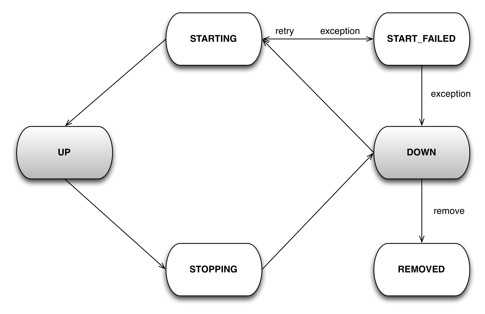

What is JBoss Modular Service Container?
----------------------------------------

* A replacement for JMX Kernel and MicroContainer

* A highly concurrent state machine

* No multiple phases, much simpler

* Does not depend on JMX or Java EE

What is a Service?
-----------------

* A POJO that can optionally depend on others

* Simple states: `DOWN`, `STARTING`, `UP`, `STOPPING`, `START_FAILED`, `REMOVED`

* Does not have multiple initialisation phases like MC did, simply implement at multiple dependent services

How to write one
----------------
