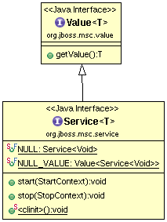
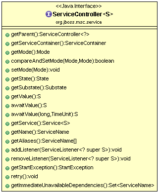

### Service

A service is a thing which can be started and stopped.  A service may be started or stopped from any thread. In general, injections will always happen from the same thread that will call `start()` method, and uninjections will always happen from the same thread that had called `stop()` method. However no other guarantees are made with respect to locking or thread safety; a robust service implementation should always take care to protect any mutable state appropriately.

An indirect value.  A value may be available trivially (without any computation), or it may involve a complex calculation to produce.  The value may also be time-sensitive, such that it is only available under certain circumstances(e.g. when the corresponding service is "up").

The value type specified by this service is used by default by consumers of this service, and should represent the public interface of this service, which may or may not be the same as the implementing type of this service.

The Figure-1 show Service interface:

When writing MSC service implementations, `start()` and `stop()` methods must never block.  This means these methods must not:

* Use network connections
* Wait for network connections
* Sleep
* Wait on a condition
* Wait on a count down latch
* Call any method which may do any of the above
* Wait for termination of a thread pool or other service
* Wait for another service to change state

If your service start/stop does any of these things, you must use the asynchronous start/stop mechanism LifecycleContext#asynchronous() and do one of the following:

* Initiate your task in start()/stop(), and utilize a callback (NIO, ThreadPoolExecutor.terminated(), etc.) to call LifecycleContext#complete() when your start/stop completes instead of blocking.
* Delegate your blocking task to a thread pool which calls LifecycleContext#complete() when done.
* Use proper dependencies instead of explicitly waiting for services in your start/stop.

Note that using LifecycleContext#execute(Runnable) to execute the blocking task is also not permissible.

A Service usually reference with a ServiceController, as Figure-2,

Use the controller we can get a service's parent service, associated service container, service controller's current mode, service state, etc.

A ServiceContainer used to manages a set of running services. 

A Service has a name, a service name can not be null or empty.

