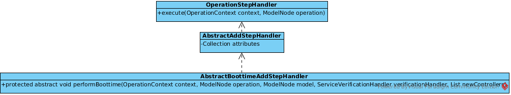

== 添加 deployer hook

`SubsystemAddHandler` 负责添加 subsystem resource 到 model， 继承了 `AbstractBoottimeAddStepHandler`

重写 performBoottime() 方法添加 deployers’s hook

[source,java]
----
@Override
public void performBoottime(OperationContext context, 
                            ModelNode operation, 
                            ModelNode model,
                            ServiceVerificationHandler verificationHandler, 
                            List<ServiceController<?>> newControllers) throws OperationFailedException {
        
    log.info("Populating the model");

    context.addStep(new AbstractDeploymentChainStep() {
        public void execute(DeploymentProcessorTarget processorTarget) {
            processorTarget.addDeploymentProcessor(SUBSYSTEM_NAME, SubsystemDeploymentProcessor.PHASE, SubsystemDeploymentProcessor.PRIORITY, new SubsystemDeploymentProcessor());
         }
    }, OperationContext.Stage.RUNTIME);
}
----

详细实现代码参照 link:acme-subsystem/src/main/java/com/acme/corp/tracker/extension/SubsystemAddHandler.java[SubsystemAddHandler.java]

`SubsystemDeploymentProcessor` 实现了 WildFly deployment 接口 `DeploymentUnitProcessor`

image:img/wildfly-deployment-DeploymentUnitProcessor.png[WildFly deployment API: DeploymentUnitProcessor]

[source,java]
----
public class SubsystemDeploymentProcessor implements DeploymentUnitProcessor {

    @Override
    public void deploy(DeploymentPhaseContext phaseContext) throws DeploymentUnitProcessingException {
        String name = phaseContext.getDeploymentUnit().getName();
        ResourceRoot root = phaseContext.getDeploymentUnit().getAttachment(Attachments.DEPLOYMENT_ROOT);
        TrackerService service = getTrackerService(phaseContext.getServiceRegistry(), name);
        if (service != null) {
            VirtualFile cool = root.getRoot().getChild("META-INF/cool.txt");
            service.addDeployment(name);
            if (cool.exists()) {
                service.addCoolDeployment(name);
            }
        }
    }

    @Override
    public void undeploy(DeploymentUnit context) {
        context.getServiceRegistry();
        String name = context.getName();
        TrackerService service = getTrackerService(context.getServiceRegistry(), name);
        if (service != null) {
            service.removeDeployment(name);
        }
    }
----

如上代码所示，当 WildFly 执行部署任务时会检查部署的 war/jar/ear 的根目录，如果 `META-INF/cool.txt` 存在就认为该部署是一个 cool 部署，将其添加到 TrackerService 的 cool 部署列表。

详细实现代码参照 link:acme-subsystem/src/main/java/com/acme/corp/tracker/deployment/SubsystemDeploymentProcessor.java[SubsystemDeploymentProcessor.java]
